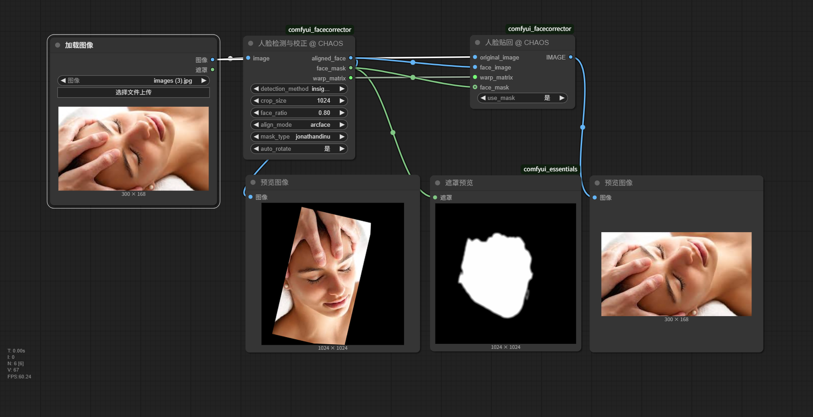

# ComfyUI FaceCorrector (人脸矫正器)

<div align="center">

[](https://github.com/CHAOSEA/comfyui_facecorrector/stargazers)
[](https://github.com/CHAOSEA/comfyui_facecorrector/network/members)
[](https://github.com/CHAOSEA/comfyui_facecorrector/issues)
[](https://github.com/CHAOSEA/comfyui_facecorrector/blob/main/LICENSE)

[English](README_EN.md) | 简体中文

强大而精确的 ComfyUI 人脸处理节点，支持智能人脸检测、自动旋转校正、精确对齐和蒙版生成。

</div>

## ✨ 功能特点

- 🎯 **智能人脸检测**：支持 YOLO 和 InsightFace 双引擎检测
- 🔄 **自动旋转校正**：智能处理倾斜、倒置或侧面人脸
- ⚖️ **精确对齐**：使用 arcface 算法进行专业级人脸对齐
- 🎭 **高质量蒙版**：支持多种蒙版生成方法 (jonathandinu, bisenet)
- 📏 **灵活调整**：通过 face_ratio 精确控制人脸比例
- 💡 **稳定可靠**：适应各种光照条件，支持极端角度处理

## 📸 效果展示



## 🚀 快速开始

### 环境要求

- ComfyUI 最新版本
- Python 3.8+
- CUDA 支持（推荐）

### 安装步骤

1. 克隆仓库到 ComfyUI 的 custom_nodes 目录：
```bash
cd ComfyUI/custom_nodes
git clone https://github.com/CHAOSEA/comfyui_facecorrector.git
```

2. 安装依赖：
```bash
cd comfyui_facecorrector
pip install -r requirements.txt
```

3. 重启 ComfyUI

### 首次使用说明

- 首次运行时会自动下载所需模型
- 模型文件将保存在 `ComfyUI/models/` 对应目录下
- 确保网络连接正常，模型下载可能需要一些时间

## 📖 使用指南

### FaceCorrector 节点

- **输入参数**：
  - `image`：要处理的图像
  - `detection_method`：人脸检测方法 (insightface, yolo)
  - `crop_size`：输出图像大小
  - `face_ratio`：人脸在图像中的占比 (0.5-1.3)
  - `align_mode`：对齐模式 (arcface)
  - `mask_type`：蒙版类型 (jonathandinu, bisenet, none)
  - `auto_rotate`：是否启用自动旋转 (是, 否)

- **输出**：
  - `aligned_face`：对齐后的人脸图像
  - `face_mask`：面部蒙版
  - `warp_matrix`：变换矩阵

### FacePaster 节点

- **输入参数**：
  - `original_image`：原始图像
  - `face_image`：修改后的人脸图像
  - `warp_matrix`：从 FaceCorrector 获得的变换矩阵
  - `use_mask`：是否使用蒙版 (是, 否)
  - `face_mask`：(可选) 面部蒙版，用于平滑混合

- **输出**：
  - `image`：合成后的完整图像

## 🔧 进阶配置

### 自动旋转功能

新增的自动旋转功能可以智能地处理各种异常角度的人脸：

1. **人脸姿态估计**：通过分析人脸关键点，精确估计人脸的 roll（翻滚角）、yaw（偏航角）和 pitch（俯仰角）
2. **智能旋转决策**：根据姿态估计结果，决定是否需要旋转以及旋转角度
3. **高质量旋转**：使用 Lanczos 插值算法进行高质量图像旋转，确保图像细节不丢失
4. **校正效果验证**：旋转后重新检测人脸并评估姿态，只有在确实改善姿态时才采用旋转结果

### 适用场景

- **倒置人脸**：例如拍摄时手机倒置，导致照片中人脸呈180度倒置
- **明显倾斜**：照片中人脸有明显的翻滚倾斜（超过10度）
- **极端侧脸**：人脸严重侧向（约90度）需要旋转调整
- **特殊情况**：即使在人脸部分遮挡或闭眼情况下，也能准确估计姿态并进行校正

### face_ratio 参数说明

`face_ratio` 参数控制人脸在输出图像中的占比，范围从 0.5 到 1.3：
- 值越大，人脸在图像中占的比例越大（显得更"近"）
- 值越小，人脸在图像中占的比例越小（显得更"远"）

## 📋 常见问题

1. **Q: 模型下载失败怎么办？**
   A: 可以手动下载模型文件，放置在对应目录下。详细步骤见 [模型下载指南](docs/model_download_guide.md)

2. **Q: 支持批量处理吗？**
   A: 目前支持批处理输入，但内部是逐个处理的。

## 🤝 贡献指南

欢迎贡献代码或提出建议！请查看我们的 [贡献指南](CONTRIBUTING.md)。

## 📝 更新日志

详细更新历史请查看 [CHANGELOG.md](CHANGELOG.md)

## ⭐ 致谢

- [InsightFace](https://github.com/deepinsight/insightface) - 提供高质量的人脸检测和分析功能
- [YOLOv8](https://github.com/ultralytics/ultralytics) - 提供快速准确的目标检测
- [BiSeNet](https://github.com/CoinCheung/BiSeNet) - 提供精确的人脸解析
- 所有贡献者和用户的宝贵反馈

## 📄 许可证

本项目采用 MIT 许可证 - 详见 [LICENSE](LICENSE) 文件

## 🌟 引用

如果您在研究中使用了本项目，请引用：

```bibtex
@software{comfyui_facecorrector,
  author = {CHAOS},
  title = {ComfyUI FaceCorrector},
  year = {2025},
  url = {https://github.com/CHAOSEA/comfyui_facecorrector}
}
``` 