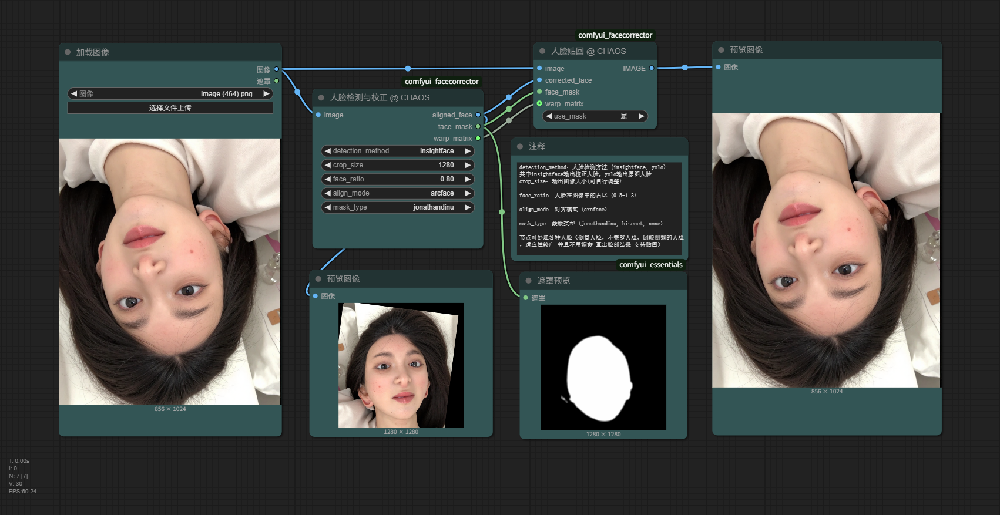
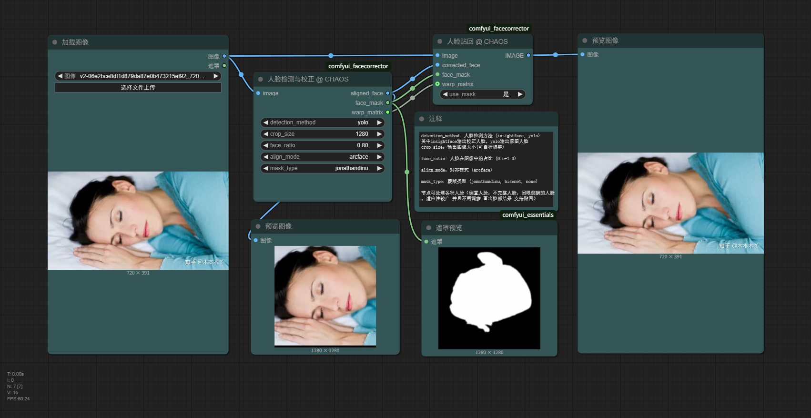

# ComfyUI FaceCorrector (人脸矫正器)

<div align="center">

[](https://github.com/CHAOSEA/comfyui_facecorrector/stargazers)
[](https://github.com/CHAOSEA/comfyui_facecorrector/network/members)
[](https://github.com/CHAOSEA/comfyui_facecorrector/issues)
[](https://github.com/CHAOSEA/comfyui_facecorrector/blob/main/LICENSE)

[English](README_EN.md) | 简体中文

ComfyUI 人脸处理节点，提供人脸检测、校正、对齐和蒙版生成功能。

</div>

## 💡 主要应用场景

本节点主要用于：
- 换脸/换头前的图像预处理
- 面部细节（眼睛、眉毛、五官等）精修前的预处理
- 需要统一人脸尺寸和朝向的场景

**核心优势**：
- 无需手动调整输入图像尺寸和角度
- 无需反复调整检测参数和阈值
- 一键生成指定尺寸、指定人脸占比的校正图像

## 📸 工作流程示例

### InsightFace 模式 (人脸校正)


### YOLO 模式 (人脸裁切)


## ✨ 功能特点

- 🎯 **智能人脸检测**：集成 YOLO 和 InsightFace 双引擎检测
- 🔄 **自动校正处理**：支持处理以下场景的人脸图像：
  - 倒置人脸（如手机倒置拍摄）
  - 倾斜人脸（偏离水平超过10度）
  - 侧面人脸（大角度侧拍）
  - 部分遮挡或闭眼状态的人脸
- ⚖️ **精确对齐**：采用 arcface 算法实现专业级人脸对齐
- 🎭 **蒙版生成**：支持多种蒙版生成方法 (jonathandinu, bisenet)
- 📏 **比例控制**：精确控制输出图像中的人脸比例

## 🚀 快速开始

### 环境要求

- ComfyUI 最新版本
- Python 3.8+
- CUDA 支持（推荐）

### 安装步骤

1. 克隆仓库到 ComfyUI 的 custom_nodes 目录：
```bash
cd ComfyUI/custom_nodes
git clone https://github.com/CHAOSEA/comfyui_facecorrector.git
```

2. 安装依赖：
```bash
cd comfyui_facecorrector
pip install -r requirements.txt
```

3. 重启 ComfyUI

### 首次使用说明

- 首次运行时会自动下载所需模型
- 模型文件将保存在 `ComfyUI/models/` 对应目录下
- 确保网络连接正常，模型下载可能需要一些时间

### 必需模型文件

本节点需要以下模型文件：

1. YOLO人脸检测模型：
   - 路径：`ComfyUI/models/ultralytics/bbox/face_yolov8m.pt`
   - 用途：快速准确的人脸检测

2. InsightFace模型：
   - 路径：`ComfyUI/models/insightface/models/buffalo_l`
   - 用途：人脸分析和关键点检测

3. BiSeNet模型：
   - 路径：`ComfyUI/models/bisenet/resnet34.onnx`
   - 用途：精确的人脸分割蒙版生成

首次运行时会自动下载这些模型文件。如果下载失败，请参考[模型下载指南](docs/model_download_guide.md)手动下载。

## 📖 使用指南

### FaceCorrector 节点

- **输入参数**：
  - `image`：要处理的图像
  - `detection_method`：人脸检测方法 (insightface, yolo)
  - `crop_size`：输出图像大小
  - `face_ratio`：人脸在图像中的占比 (0.5-1.3)
  - `align_mode`：对齐模式 (arcface)
  - `mask_type`：蒙版类型 (jonathandinu, bisenet, none)
  - `auto_rotate`：是否启用自动旋转 (是, 否)

- **输出**：
  - `aligned_face`：对齐后的人脸图像
  - `face_mask`：面部蒙版
  - `warp_matrix`：变换矩阵

### FacePaster 节点

- **输入参数**：
  - `image`：原始图像
  - `corrected_face`：修改后的人脸图像
  - `face_mask`：面部蒙版，用于平滑混合
  - `use_mask`：是否使用蒙版 (是, 否)
  - `warp_matrix`：(可选) 从 FaceCorrector 获得的变换矩阵

- **输出**：
  - `image`：合成后的完整图像

## 🔧 进阶配置

### face_ratio 参数说明

`face_ratio` 参数用于控制人脸在输出图像中的占比，范围从 0.5 到 1.3：
- 值越大，人脸在图像中占比越大（画面更集中于面部）
- 值越小，人脸在图像中占比越小（画面包含更多背景）

## 📋 常见问题

1. **Q: 模型下载失败怎么办？**
   A: 可以手动下载模型文件，放置在对应目录下。详细步骤见 [模型下载指南](docs/model_download_guide.md)

2. **Q: 支持批量处理吗？**
   A: 目前支持批处理输入，但内部是逐个处理的。

## 🤝 贡献指南

欢迎贡献代码或提出建议！请查看我们的 [贡献指南](CONTRIBUTING.md)。

## 📝 更新日志

详细更新历史请查看 [CHANGELOG.md](CHANGELOG.md)

## ⭐ 致谢

- [InsightFace](https://github.com/deepinsight/insightface) - 提供高质量的人脸检测和分析功能
- [YOLOv8](https://github.com/ultralytics/ultralytics) - 提供快速准确的目标检测
- [BiSeNet](https://github.com/CoinCheung/BiSeNet) - 提供精确的人脸解析
- 所有贡献者和用户的宝贵反馈

## 📄 许可证

本项目采用 MIT 许可证 - 详见 [LICENSE](LICENSE) 文件

## 🌟 引用

如果您在研究中使用了本项目，请引用：

```bibtex
@software{comfyui_facecorrector,
  author = {CHAOS},
  title = {ComfyUI FaceCorrector},
  year = {2025},
  url = {https://github.com/CHAOSEA/comfyui_facecorrector}
}
```

## 🌟 支持与反馈

如果这个节点对您的工作有所帮助，欢迎给我们一个 Star ⭐，这是对我们最好的鼓励！

### 社区支持

- 遇到使用问题？
- 有定制化需求？
- 想交流经验心得？

欢迎加入我们的 QQ 交流群：247228975

我们致力于为每一位用户提供专业的技术支持和解决方案。 