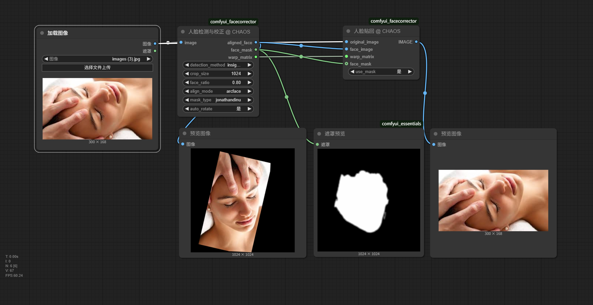

# ComfyUI FaceCorrector

<div align="center">

[](https://github.com/CHAOSEA/comfyui_facecorrector/stargazers)
[](https://github.com/CHAOSEA/comfyui_facecorrector/network/members)
[](https://github.com/CHAOSEA/comfyui_facecorrector/issues)
[](https://github.com/CHAOSEA/comfyui_facecorrector/blob/main/LICENSE)

English | [简体中文](README.md)

A powerful and precise ComfyUI node for face processing, supporting intelligent face detection, automatic rotation correction, precise alignment, and mask generation.

</div>

## 📸 Workflow Examples

### InsightFace Mode


### YOLO Mode


## ✨ Features

- 🎯 **Smart Face Detection**: Dual-engine detection with YOLO and InsightFace
- 🔄 **Auto Rotation Correction**: Intelligently handles tilted, inverted, or side-facing faces
- ⚖️ **Precise Alignment**: Professional-grade face alignment using arcface algorithm
- 🎭 **High-Quality Masks**: Multiple mask generation methods (jonathandinu, bisenet)
- 📏 **Flexible Adjustment**: Precise face ratio control through face_ratio parameter
- 💡 **Stable & Reliable**: Adapts to various lighting conditions, handles extreme angles

## 📸 Demo



## 🚀 Quick Start

### Requirements

- Latest version of ComfyUI
- Python 3.8+
- CUDA support (recommended)

### Installation

1. Clone the repository to your ComfyUI custom_nodes directory:
```bash
cd ComfyUI/custom_nodes
git clone https://github.com/CHAOSEA/comfyui_facecorrector.git
```

2. Install dependencies:
```bash
cd comfyui_facecorrector
pip install -r requirements.txt
```

3. Restart ComfyUI

### First Use Notes

- Required models will be downloaded automatically on first run
- Model files will be saved in the corresponding `ComfyUI/models/` directory
- Ensure internet connectivity for model downloads

### Required Models

This node requires the following model files:

1. YOLO Face Detection Model:
   - Path: `ComfyUI/models/ultralytics/bbox/face_yolov8m.pt`
   - Purpose: Fast and accurate face detection

2. InsightFace Model:
   - Path: `ComfyUI/models/insightface/models/buffalo_l`
   - Purpose: Face analysis and landmark detection

3. BiSeNet Model:
   - Path: `ComfyUI/models/bisenet/resnet34.onnx`
   - Purpose: Precise face segmentation mask generation

These models will be downloaded automatically on first run. If download fails, please refer to the [Model Download Guide](docs/model_download_guide.md) for manual download.

## 📖 Usage Guide

### FaceCorrector Node

- **Input Parameters**:
  - `image`: Image to process
  - `detection_method`: Face detection method (insightface, yolo)
  - `crop_size`: Output image size
  - `face_ratio`: Face height ratio in image (0.5-1.3)
  - `align_mode`: Alignment mode (arcface)
  - `mask_type`: Mask type (jonathandinu, bisenet, none)
  - `auto_rotate`: Enable automatic rotation (yes, no)

- **Outputs**:
  - `aligned_face`: Aligned face image
  - `face_mask`: Face mask
  - `warp_matrix`: Transformation matrix

### FacePaster Node

- **Input Parameters**:
  - `image`: Original image
  - `corrected_face`: Modified face image
  - `face_mask`: Face mask for smooth blending
  - `use_mask`: Use mask (yes, no)
  - `warp_matrix`: (Optional) Transformation matrix from FaceCorrector

- **Output**:
  - `image`: Final composited image

## 🔧 Advanced Configuration

### Auto Rotation Feature

The auto-rotation feature intelligently handles faces at various abnormal angles:

1. **Face Pose Estimation**: Precisely estimates face roll, yaw, and pitch angles through facial landmark analysis
2. **Smart Rotation Decision**: Determines rotation necessity and angle based on pose estimation
3. **High-Quality Rotation**: Uses Lanczos interpolation for high-quality image rotation, preserving details
4. **Correction Validation**: Re-detects face and evaluates pose post-rotation, applying changes only if pose improves

### Use Cases

- **Inverted Faces**: Handles 180-degree inverted faces from upside-down photos
- **Significant Tilt**: Corrects faces with noticeable roll tilt (over 10 degrees)
- **Extreme Side View**: Adjusts severely side-facing faces (around 90 degrees)
- **Special Cases**: Accurately estimates and corrects pose even with partial occlusion or closed eyes

### face_ratio Parameter

The `face_ratio` parameter controls face proportion in the output image, ranging from 0.5 to 1.3:
- Higher values make the face appear larger (closer)
- Lower values make the face appear smaller (farther)

## 📋 FAQ

1. **Q: What if model download fails?**
   A: You can manually download model files and place them in the corresponding directory. See [Model Download Guide](docs/model_download_guide.md)

2. **Q: Is batch processing supported?**
   A: Currently supports batch input, but processes internally one by one.

## 🤝 Contributing

Contributions and suggestions are welcome! Please check our [Contributing Guide](CONTRIBUTING.md).

## 📝 Changelog

See [CHANGELOG.md](CHANGELOG.md) for detailed update history.

## ⭐ Acknowledgments

- [InsightFace](https://github.com/deepinsight/insightface) - High-quality face detection and analysis
- [YOLOv8](https://github.com/ultralytics/ultralytics) - Fast and accurate object detection
- [BiSeNet](https://github.com/CoinCheung/BiSeNet) - Precise face parsing
- All contributors and users for valuable feedback

## 📄 License

This project is licensed under the MIT License - see the [LICENSE](LICENSE) file for details

## 🌟 Citation

If you use this project in your research, please cite:

```bibtex
@software{comfyui_facecorrector,
  author = {CHAOS},
  title = {ComfyUI FaceCorrector},
  year = {2025},
  url = {https://github.com/CHAOSEA/comfyui_facecorrector}
}
```

## 🌟 Support & Feedback

If this node has been helpful in your workflow, please consider giving us a Star ⭐. Your support motivates us to keep improving!

### Community Support

- Having technical issues?
- Need customization?
- Want to share experiences?

Join our QQ community group: 247228975

We are committed to providing professional technical support and solutions for every user. 